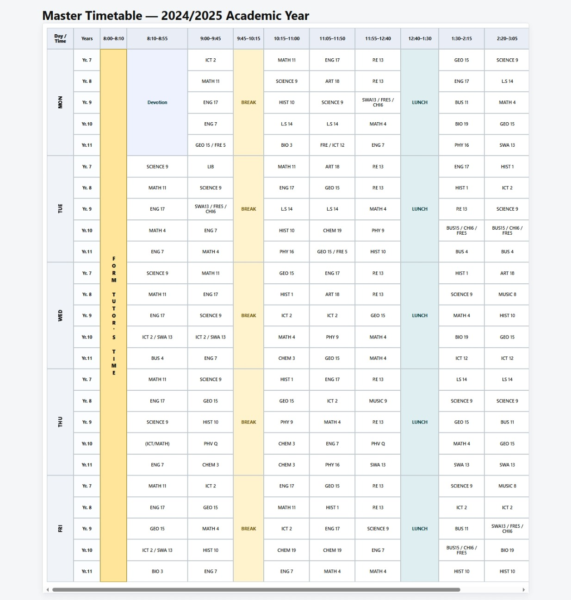

# 2024/2025 Academic Year Timetable (School Project)

## Objective
The goal of this project was to recreate the **2024/2025 Academic Year Timetable** using **HTML and CSS Grid**, following the provided image reference.  
This exercise tested knowledge of semantic HTML, CSS Grid layout, accessibility practices, and styling consistency.

---

## Project Structure
📂 timetable-project

├── index.html # Main timetable structure (HTML + CSS Grid)

├── styles.css # Styling for timetable layout and design

└── README.md # Documentation and instructions

---

## Layout Specifications

### Structure
- **Fixed layout:** Centered on the page with consistent dimensions.  
- **Columns:**
  - 1 column for "Day / Year".
  - 13 columns for time slots (8:00 AM – 4:00 PM).  
- **Rows:**
  - Header row for time slots.
  - Content rows for Year 7 – Year 11 under each day.  

### Merging
- **Vertical merging:** Activities like **Devotion, Break, Lunch, Clubs, Gender Meeting, Games, Mind Lecture** span all year groups.  
- **Horizontal merging:** Subjects spanning multiple time slots are achieved using `grid-column`.  

### Styling Guidelines
- Borders: Uniform, no double borders.  
- Font: Clean, sans-serif.  
- Alignment: Centered text, consistent padding.  
- Highlights: Breaks, lunch, and activities styled with distinct background colors.  

---

## Accessibility Considerations
- **Semantic HTML**:  
  - `<header>` for title,  
  - `<main>` for timetable grid,  
  - `<footer>` for credits.  
- **Table-like structure with CSS Grid** ensures logical reading order.  
- **Alt text**: The timetable preview image has descriptive alt text in this README.  
- **Contrast & readability**: Sufficient background/foreground color contrast.

---

## How I Implemented It
1. **Grid Setup**  
   - I created a container `
` and applied `display: grid`.  
   - Defined **14 columns** (1 for “Day/Year”, 13 for time slots).  
   - Defined rows for the header and each year group.  

2. **Header Row (Time Slots)**  
   - Used `
` items for each time range (8:00–4:00).  
   - Applied `grid-column` so each header aligns correctly.  

3. **Days and Years**  
   - Each day (Mon–Fri) spans **5 rows (Yr7–Yr11)**.  
   - Added a label column on the left to show the day.  

4. **Subjects and Activities**  
   - Each subject is placed in its correct **row and column** using `grid-row` and `grid-column`.  
   - For example:  
     - “Devotion” → spanned from Yr7 to Yr11 under column 2.  
     - “Break” → spanned all rows across its time slot.  
     - “Games” → spanned from Yr7–Yr11 at the end of the day.  

5. **Merging Without Tables**  
   - Instead of `<table rowspan>` or `<colspan>`, I used:  
     - `grid-row: start / end` → vertical span.  
     - `grid-column: start / end` → horizontal span.  

6. **Styling**  
   - Borders: `1px solid black`, consistent around all cells.  
   - Breaks and lunch: highlighted with background color.  
   - Font: `sans-serif`, centered using `text-align: center` and `display: flex; align-items: center; justify-content: center;`.  

---

## How to Run
1. Clone or download this project folder.  
2. Open `index.html` in any modern web browser.  
3. The timetable will display with fixed dimensions.  

---

## Preview
Below is the timetable reference image provided:

---

## Author
- **Student Name:** *[Alfred Njeru]*

---
